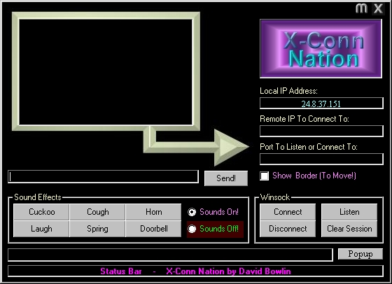



## Updated  \-   X\-Nation Chat \(2nd update\)

### Description

Use winsock to chat, and play sound effects on local and remote computer. Cool interface. Plz leave feedback, and vote. Thanks!
 
### More Info
 

             |
---                |---
**Submitted On**   |2000-08-18 22:44:50
**By**             |[N/A](https://github.com/Planet-Source-Code/PSCIndex/blob/master/ByAuthor/empty.md)
**Level**          |Beginner
**User Rating**    |5.0 (10 globes from 2 users)
**Compatibility**  |VB 6\.0
**Category**       |[Internet/ HTML](https://github.com/Planet-Source-Code/PSCIndex/blob/master/ByCategory/internet-html__1-34.md)
**World**          |[Visual Basic](https://github.com/Planet-Source-Code/PSCIndex/blob/master/ByWorld/visual-basic.md)
**Archive File**   |[CODE\_UPLOAD91118182000\.zip](https://github.com/Planet-Source-Code/updated-x-nation-chat-2nd-update__1-10813/archive/master.zip)

